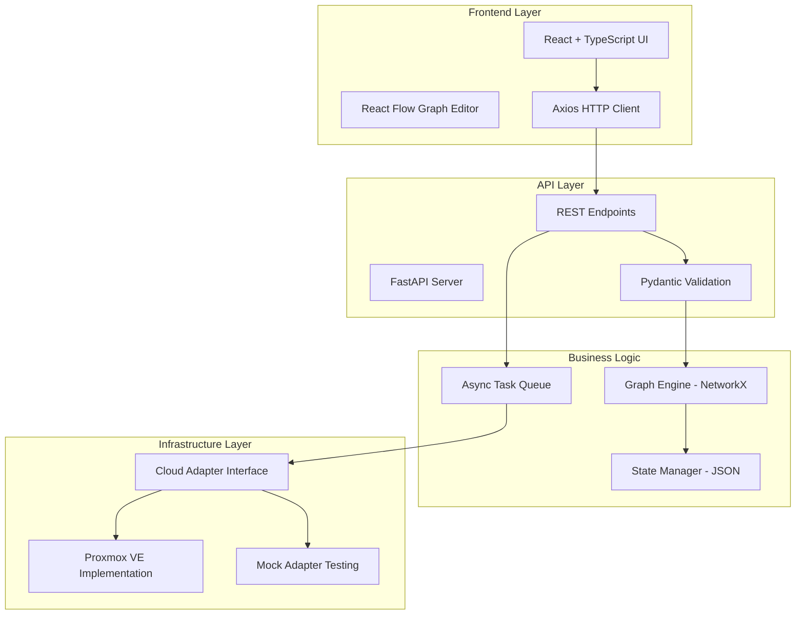

# Cyber Range Orchestrator

A Software-Defined Infrastructure Platform for Automated Virtual Environment Deployment

[](https://www.python.org/downloads/)
[](https://fastapi.tiangolo.com/)
[](https://reactjs.org/)
[](https://www.typescriptlang.org/)
[](https://www.proxmox.com/en/proxmox-ve)

## Overview

The Cyber Range Orchestrator transforms complex virtual infrastructure deployment into a visual workflow. This combines graph theory with modern cloud orchestration patterns. It enables users to design, validate, and deploy isolated cyber environments for cybersecurity training and research.

## Key Features

**Intelligent Graph Engine**
- Topology validation using NetworkX algorithms to ensure valid undirected trees
- Automated bridge mapping with unique isolated Linux bridges per network segment
- Smart connectivity with automatic jumpbox identification and external network access

**Type-Safe API Architecture**
- Strict type safety through Pydantic schema validation
- Async background processing with FastAPI BackgroundTasks

**Stateful Infrastructure Management**
- Persistent state with atomic JSON storage operations
- Complete lifecycle management from creation to destruction
- State syncing between desired and actual infrastructure
- Avoids updating unmodified network components for each update

**Design Patterns**
- Abstract adapter interface for multiple hypervisor platforms
- Modular architecture with clean separation of concerns
- Proper mock testing capabilities

## Architecture Overview



**Deployment Workflow**

1. **Design Phase**: User creates network topology via interactive graph interface
2. **Validation Phase**: Graph engine validates topology integrity and connectivity
3. **Planning Phase**: Algorithm assigns bridge IDs and computes resource requirements
4. **Persistence Phase**: State manager saves configuration with atomic guarantees
5. **Execution Phase**: Background tasks orchestrate VM provisioning and network configuration
6. **Monitoring Phase**: Continuous state reconciliation ensures desired state compliance

## Technology Stack

**Backend**: Python 3.12+, FastAPI, NetworkX, Pydantic, Proxmoxer, pytest
**Frontend**: React 19, TypeScript 5.9, Vite, React Flow, Axios
**Quality Tools**: uv, Ruff, MyPy, ESLint

## Quick Start

**Prerequisites**: Python 3.12+ with uv, Node.js 18+, Proxmox VE (optional)

**Setup**
```bash
# Clone repository
git clone <repository_url>
cd Local-Deployments

# Backend setup
uv install
cp .env.example .env
uv run uvicorn backend.app.main:app --reload --port 8000

# Frontend setup (new terminal)
cd frontend
npm install
npm run dev
```

**Access**
- Frontend Interface: http://localhost:5173
- API Documentation: http://localhost:8000/docs

## Usage

**Creating a Cyber Range**
1. Access the web interface at http://localhost:5173
2. Design topology by adding nodes and connecting them
3. Click "Deploy to Proxmox" to initiate provisioning
4. Monitor progress in browser console and backend logs

**API Example**
```bash
curl -X POST http://localhost:8000/api/v1/range \
  -H "Content-Type: application/json" \
  -d '{
    "range_metadata": {
      "id": "550e8400-e29b-41d4-a716-446655440000",
      "name": "Lab"
    },
    "nodes": [
      {"id": "jumpbox-1", "label": "Gateway", "template_id": 100, "role": "jumpbox_main"},
      {"id": "target-1", "label": "Web Server", "template_id": 101, "role": "service"}
    ],
    "links": [
      {"source": "jumpbox-1", "target": "target-1", "connection_type": "vlan_bridge"}
    ]
  }'
```

## Configuration

Create `.env` file:
```env
APP_MODE=DEV  # Set to PROD for Proxmox integration
PVE_HOST=your-proxmox-host.domain.com
PVE_USER=root@pam
PVE_TOKEN_NAME=your-token-name
PVE_TOKEN_VALUE=your-token-value
```

## Testing

```bash
# Backend tests
cd backend
uv run pytest tests/unit/ -v
PYTHONPATH=. uv run python tests/integration/test_pve_adapter.py

# Code quality
uv run ruff check backend/
uv run mypy backend/

# Frontend
cd frontend
npm run lint
npm run build
```

## Project Structure

```
Local-Deployments/
├── backend/
│   ├── app/
│   │   ├── adapters/        # Infrastructure abstraction layer
│   │   ├── api/             # REST API endpoints
│   │   ├── core/            # Main logic (graph engine, state manager)
│   │   └── models/          # Pydantic schemas
│   └── tests/              # Unit and integration tests
├── frontend/               # React TypeScript application
│   └── src/
├── pyproject.toml         # Python dependencies and configuration
└── .env.example          # Environment configuration template
```